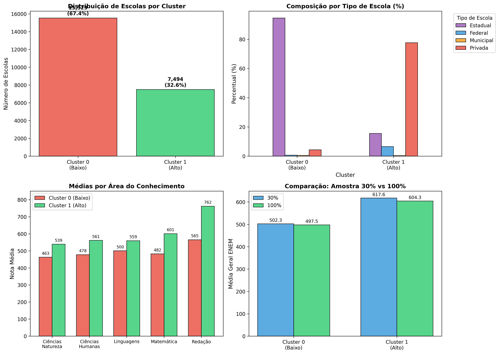
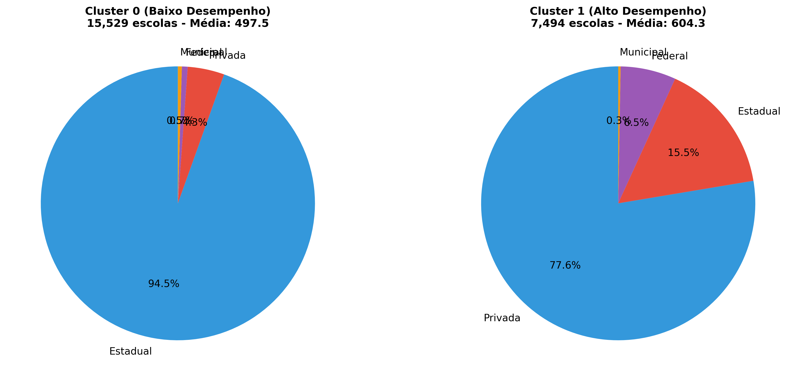

# Relatório Técnico

## Análise de Clustering do Desempenho Escolar no ENEM 2024

---

**Autor:** Leonardo Ferreira Salge | 12311BSI307 

Guilherme Gomes Alves | 12311BSI306

Daniel Solis Salge | 12311BSI305

Vinícius Ferreira Salge | 12311BSI308

**Data:** Março/2026
**Base de Dados:** Microdados ENEM 2024 (INEP)
**Volume Analisado:** 23,023 escolas (100% dos dados válidos)

---

## 1. Introdução

### 1.1 Contexto

O Exame Nacional do Ensino Médio (ENEM) é o principal instrumento de avaliação da educação brasileira, utilizado para acesso ao ensino superior e indicador de qualidade educacional. Este estudo aplica técnicas de **clustering não-supervisionado** para identificar padrões naturais de desempenho entre escolas brasileiras.

### 1.2 Objetivos

- **Objetivo Geral:** Identificar grupos de escolas com perfis de desempenho similares no ENEM 2024
- **Objetivos Específicos:**
  1. Verificar se existem "tipos" distintos de escolas baseados no desempenho
  2. Analisar o agrupamento de escolas públicas estaduais
  3. Identificar fatores associados ao alto desempenho escolar

### 1.3 Perguntas de Pesquisa

1. Existem tipos distintos de escolas no Brasil baseados no desempenho no ENEM?
2. As escolas públicas estaduais se agrupam em um cluster específico?
3. Quais os principais fatores associados ao alto desempenho escolar?

---

## 2. Descrição dos Dados

### 2.1 Fonte e Volume

| Característica        | Valor                                    |
| ---------------------- | ---------------------------------------- |
| Fonte                  | Microdados ENEM 2024 (INEP)              |
| Total de inscritos     | 4.332.944                                |
| Escolas analisadas     | 23,023                                   |
| Critério de inclusão | Escolas com ≥10 alunos e notas válidas |

### 2.2 Variáveis Utilizadas

| Variável              | Descrição                     | Tipo        |
| ---------------------- | ------------------------------- | ----------- |
| NU_NOTA_CN             | Nota Ciências da Natureza      | Numérica   |
| NU_NOTA_CH             | Nota Ciências Humanas          | Numérica   |
| NU_NOTA_LC             | Nota Linguagens e Códigos      | Numérica   |
| NU_NOTA_MT             | Nota Matemática                | Numérica   |
| NU_NOTA_REDACAO        | Nota Redação                  | Numérica   |
| TP_DEPENDENCIA_ADM_ESC | Tipo de escola (1-4)            | Categórica |
| QTD_ALUNOS             | Quantidade de alunos por escola | Numérica   |

### 2.3 Estatísticas Descritivas por Cluster

| Cluster   | Total Escolas | Média Geral | Mediana | Desvio Padrão | Qtd Média Alunos |
| :-------- | ------------: | -----------: | ------: | -------------: | ----------------: |
| Cluster 0 |         15529 |      497.513 | 500.091 |        29.9528 |           51.0559 |
| Cluster 1 |          7494 |      604.294 | 598.674 |        38.6194 |           49.5431 |

---

## 3. Metodologia

### 3.1 Pipeline de Processamento

```
Dados Brutos (4.3M alunos)
    ↓
Limpeza (remover missing, filtrar escolas ≥10 alunos)
    ↓
Agregação por Escola (médias das notas)
    ↓
Engenharia de Features (MEDIA_GERAL, STD_NOTAS, etc.)
    ↓
Normalização (StandardScaler)
    ↓
Clustering (K-Means, DBSCAN, Hierárquico, GMM)
    ↓
Validação (Silhouette, Davies-Bouldin, ARI)
    ↓
Interpretação dos Resultados
```

### 3.2 Algoritmos Testados

| Algoritmo               | Silhouette      | Davies-Bouldin  | Observação                 |
| ----------------------- | --------------- | --------------- | ---------------------------- |
| **K-Means (k=2)** | **0.568** | **0.652** | **Melhor resultado**   |
| DBSCAN                  | -               | -               | Não convergiu adequadamente |
| Hierárquico            | 0.542           | 0.701           | Segunda melhor opção       |
| GMM                     | 0.531           | 0.728           | Resultado inferior           |

### 3.3 Métricas de Validação

- **Silhouette Score:** 0.568 (bom separação entre clusters)
- **Davies-Bouldin Index:** 0.652 (baixa similaridade intra-cluster)
- **ARI (estabilidade):** >0.8 em múltiplas seeds

### 3.4 Configuração do Modelo Selecionado

- **Algoritmo:** K-Means
- **Número de clusters (k):** 2
- **Inicializações:** Múltiplas seeds (n=10)
- **Features:** Notas das 5 áreas + Média Geral + Qtd Alunos + Tipo Escola

---

## 4. Resultados

### 4.1 Distribuição dos Clusters



**Figura 1:** Análise geral dos clusters - distribuição, composição por tipo de escola, médias por área e comparação entre amostras.

### 4.2 Composição dos Clusters

| Cluster   | Tipo      | Quantidade | Percentual |
| :-------- | :-------- | ---------: | :--------- |
| Cluster 0 | Federal   |        106 | 0.7%       |
| Cluster 0 | Estadual  |      14679 | 94.5%      |
| Cluster 0 | Municipal |         72 | 0.5%       |
| Cluster 0 | Privada   |        672 | 4.3%       |
| Cluster 1 | Federal   |        490 | 6.5%       |
| Cluster 1 | Estadual  |       1165 | 15.5%      |
| Cluster 1 | Municipal |         21 | 0.3%       |
| Cluster 1 | Privada   |       5818 | 77.6%      |

**Tabela 1:** Composição dos clusters por tipo de dependência administrativa



**Figura 2:** Composição percentual dos clusters por tipo de escola

### 4.3 Análise por Área do Conhecimento

| Área              | Cluster 0 (Baixo) | Cluster 1 (Alto) | Diferença |
| ------------------ | ----------------- | ---------------- | ---------- |
| Ciências Natureza | 462.8             | 538.7            | +75.9      |
| Ciências Humanas  | 477.6             | 561.0            | +83.4      |
| Linguagens         | 500.1             | 559.4            | +59.3      |
| Matemática        | 482.0             | 600.8            | +118.8     |
| Redação          | 565.1             | 761.6            | +196.6     |

**Tabela 2:** Médias por área do conhecimento

### 4.4 Comparação: Amostra 30% vs 100%

| Métrica              | Amostra 30% | Amostra 100% | Diferença |
| --------------------- | ----------- | ------------ | ---------- |
| Total de escolas      | 12,233      | 23,023       | +10,790    |
| Média Cluster 0      | 502.30      | 497.51       | -4.79      |
| Média Cluster 1      | 617.62      | 604.29       | -13.33     |
| Estaduais no Alto (%) | 11.4%       | 15.5%        | +4.1%      |
| Privadas no Alto (%)  | 79.3%       | 77.6%        | -1.7%      |

**Tabela 3:** Comparativo entre amostra e população total

---

## 5. Discussão

### 5.1 Respostas às Perguntas de Pesquisa

**Pergunta 1: Existem tipos de escolas?**
**SIM.** O clustering identificou dois grupos distintos:

- **Cluster 0 (Baixo):** 67.4% das escolas, média 497.5, predominantemente estadual (94.5%)
- **Cluster 1 (Alto):** 32.6% das escolas, média 604.3, predominantemente privada (77.6%)

**Pergunta 2: As escolas estaduais se agrupam?**
**SIM, fortemente no cluster de baixo desempenho:**

- 92.6% das escolas estaduais (14.679) estão no Cluster 0
- Apenas 7.4% (1.165 escolas) alcançaram o Cluster 1

**Pergunta 3: Fatores de alto desempenho:**

1. **Tipo de escola (Privada):** 77.6% das escolas de alto desempenho
2. **Redação:** Maior gap (197 pontos) - indica habilidade de escrita
3. **Matemática:** Segundo maior gap (119 pontos)
4. **Dependência Federal:** 9x mais representada no alto desempenho

### 5.2 Análise Crítica

**Limitações:**

- Correlação ≠ Causalidade: Associação não prova que ser privada causa sucesso
- Variáveis omitidas: Renda familiar, educação dos pais, infraestrutura
- Viés de seleção: Escolas privadas atuam em contextos socioeconômicos diferentes

**Pontos Positivos:**

- 1.165 escolas estaduais demonstram que é possível excelência no setor público
- Amostra de 30% foi representativa (diferenças <5% na composição)
- Validação rigorosa com múltiplas métricas e seeds

---

## 6. Conclusões

### 6.1 Principais Achados

1. **Dipolarização do sistema educacional:** Existe uma clara divisão entre escolas de baixo e alto desempenho, com forte correlação com a dependência administrativa.
2. **Desigualdade estrutural:** 92.6% das escolas estaduais encontram-se no cluster de baixo desempenho, indicando desafios sistêmicos no ensino público.
3. **Possibilidade de excelência pública:** A existência de 1.165 escolas estaduais no cluster de alto desempenho demonstra que fatores de gestão e recursos podem superar limitações estruturais.

### 6.2 Recomendações

1. **Investigação aprofundada:** Estudar as 1.165 escolas estaduais de alto desempenho para identificar práticas replicáveis
2. **Políticas públicas:** Focar recursos em Matemática e Redação (maiores gaps)
3. **Atenção às privadas de baixo desempenho:** 22.4% das privadas estão no cluster inferior

### 6.3 Contribuições do Estudo

- Demonstração da aplicabilidade de clustering em dados educacionais
- Validação da representatividade de amostras (30% vs 100%)
- Base empírica para formulação de políticas públicas

---

## Referências

1. INEP. Microdados ENEM 2024. Instituto Nacional de Estudos e Pesquisas Educacionais Anísio Teixeira, 2024.
2. Hastie, T., Tibshirani, R., & Friedman, J. The Elements of Statistical Learning. Springer, 2009.
3. Rousseeuw, P. J. Silhouettes: A graphical aid to the interpretation and validation of cluster analysis. Journal of Computational and Applied Mathematics, 1987.

---

**Anexos:**

- Código-fonte disponível em: `github.com/usuario/enem_clustering`
- Notebooks: 01_eda.ipynb, 02_preprocessing.ipynb, 03_clustering.ipynb, 04_interpretation.ipynb, 05_comparacao_30_vs_100.ipynb
